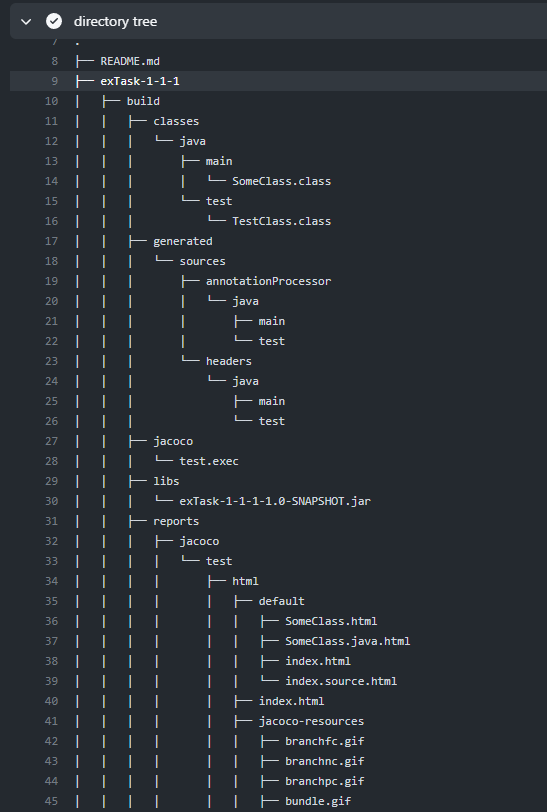

### ExampleBuild (краткая информация)
При создании проекта можете удалить `build.gradle` в
изначальной папке, но можете и не удалять. \
При изменении папок джавадоков и джакоко, нужно изменять 
`oop.yml`
Создание проекта такое же, как и обычное. Вначале git clown \
Дальше достаёте файлы, удаляете её, создаёте проект с такой
же папкой. 

Если у вас уже есть проект, и он схож с данным, то только
добавьте .github или изменённый [oop.yml](.github/workflows/oop.yml)

# Инструкции для подключения Workflow

## Workflow файл


Для подключения workflow необходимо скопировать директорию [`.github`](.github) в корень вашего репозитория (Можно запушить сразу в `master`). \
Добавьте [.gitignore](.gitignore) файл из примера. Можете удалить `build.gradle` из общей папки \
Теперь после каждого пуша в pull request (пуш в ветку на которой открыт pull request) будет запускать проверки, которые включают:
- Сборка Gradle проекта
- Запуск тестов
- Проверка покрытия кода тестами (должно быть больше 80%, отчёт будет прикплеплён как комментарий в pull request)
- Генерация javadoc и публикация их в ветку `gh-pages`
- Проверка кода на соответствие Google Java Style (замечания будут отображаться во вкладке `Files changed`

**!!ВАЖНО!!**
при открытии pull request его имя должно совпадать с именем папки в которой находится код вашей лабораторной, например `Task_1_1_1` для лабораторной в первом семестре, из первого раздела номер один.


## Настройки репозитория

Для того, чтобы у вас был доступ к опубликованной документации лабораторных, необходимо зайти в `Settings > Pages` и в секции `Build and deployment` выбрать следующие параметры  


После этого вы сможете открывать вашу документацию по адресу `https://<Github username>.github.io/OOP/<Lab name>/`


Добавьте преподавателя в коллабораторы `settings->collaborators`

## Настройка `build.gradle`

Можете скачать/скопировать [build.gradle](build.gradle) с данного репозитория или самим настроить:
Для составления отчётов по покрытию тестами вашего кода, необходимо подключить в ваш gradle скрипт плагин `jacoco`. Для этого:
- Добавьте строчку `id 'jacoco'` в плагины
```Groovy
plugins {
    id 'java'
    id 'jacoco'
}
```
- Базовые `dependencies` для тестов
```Groovy
dependencies {
    testImplementation 'org.junit.jupiter:junit-jupiter-api:5.8.1'
    testImplementation 'org.junit.jupiter:junit-jupiter-params:5.8.2'
    testRuntimeOnly 'org.junit.jupiter:junit-jupiter-engine:5.8.1'
}
```

- Измените задачу `jacocoTestReport`, чтобы она генерировала отчёт в формате `.xml`, а не только `.html` (достаточно скопировать код в конец вашего `build.gradle`)
- Чтобы не участвовали в проверке другие классы (например `Main.class`), измените exclude
```Groovy
jacocoTestReport {
    dependsOn test // tests are required to run before generating the report
    reports {
        xml.required = true
        //html.outputLocation = layout.buildDirectory.dir('jacocoHtml') Доп опция, чтобы у себя можно было открыть html
    }
    afterEvaluate {
        classDirectories.setFrom(files(classDirectories.files.collect {
            fileTree(dir: it, exclude: [
                    "Main.class", //"<package>.Main.class" Указывайте полное имея пакета с точками
            ])
        }))
    }
}
```

## oop.yml
Здесь чуть подробнее объясню про oop.yml
Некоторые вещи, вы можете сами настроить, если у вас в проекте специфичные настройки

- Если у вас `master` - `default branch`, то надо поменять следующее
```yaml
on:
  pull_request:
    branches: [ "main" ] # "master" Если ветка дефолтная - мастер (если локально создавали)
  workflow_dispatch:
  #Здесь можете поставить условия, когда запускать wf
```
- Запускает билд, и репорты с помощью [gradlew](gradlew)
```yaml
      - name: Execute Gradle build
        run: ./gradlew ${{ github.event.pull_request.title }}:build


      - name: Generate Jacoco report
        run: ./gradlew ${{ github.event.pull_request.title }}:jacocoTestReport
```
- Если `javadocs` или `reports` сохраняете в другие файлы, то поменяйте след строки:
```yaml
      # При возникновении ошибок, можете посмотреть на рабочее дерево
      - name: Check coverage and publish
        id: jacoco
        uses: madrapps/jacoco-report@v1.2
        with:
          paths: ./${{ github.event.pull_request.title }}/build/reports/jacoco/test/jacocoTestReport.xml
          #  ./${{ github.event.pull_request.title }}/build/customJacocoReportDir/test/jacocoTestReport.xml
          token: ${{ secrets.GITHUB_TOKEN }}
          min-coverage-overall: 80
          min-coverage-changed-files: 80
      #...
      #...
      #...
      - name: Publish javadoc
        uses: JamesIves/github-pages-deploy-action@v4
        with:
          token: ${{ secrets.GITHUB_TOKEN }}
          branch: gh-pages
          clean: true
          folder: ${{ github.event.pull_request.title }}/build/docs/javadoc
          # Если джавадоки не там, то можете поменять директорию выше, опираясь на дерево выше
          target-folder: ${{ github.event.pull_request.title }}
```
Это может произойти, например если сделали настройку в гредле:
```groovy
jacoco {
    toolVersion = "0.8.8"
    reportsDirectory = layout.buildDirectory.dir('customJacocoReportDir')
    //Если включите данную опцию, то в воркфлоу у метки #JCC, поменяйте путь
}
```


- Для отладки, можете просматривать рабочую директорию
```yaml
      - name: directory tree
        run: tree
```
- Открываем

- Кликаем

- Смотрим
